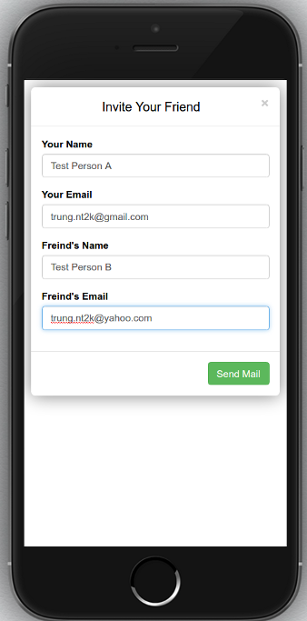

Simple WebRTC Video Meeting 
---------------------------
(using PubNub as signal server)

+ The goal of this project to replace Cisco WebMeeting or Google+ Hangout with something 100% open-source! 

+ Right now it can only send email invitation for an online video chat (work both on Desktop & Mobile platform) 
... next feature for screensharing, etc ...

    
Version History
---------------

Alpha v0.1:
  + Can forward email using only Javascrip
  + Start video right after send email
    and wait for hand-shake connection

Future release:
  + Need to implement generate conference link
  + Need to implement detect online users

Live Demo
---------

https://swvm.online
-------------------

Installation on localhost
-------------------------

- Launch server from command line with Python 3 installed: 'python3 -m http.server 8001'
- Access localhost: 'http://localhost:8001'
 
Installation on live server
-------------------------
- Pleas have SSL certificate enabled:
- Tutorial --> https://www.digitalocean.com/community/tutorials/how-to-secure-nginx-with-let-s-encrypt-on-ubuntu-14-04
